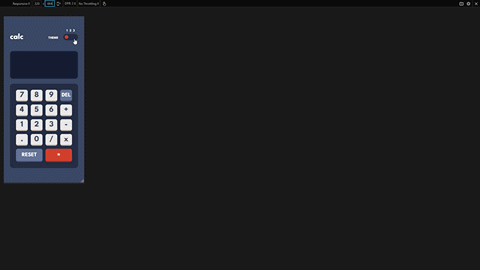

# Frontend Mentor - Calculator app solution

This is a solution to the [Calculator app challenge on Frontend Mentor](https://www.frontendmentor.io/challenges/calculator-app-9lteq5N29). Frontend Mentor challenges help you improve your coding skills by building realistic projects.

## Table of contents

- [Overview](#overview)
  - [The challenge](#the-challenge)
  - [Screencast](#screencast)
  - [Links](#links)
- [My process](#my-process)
  - [Built with](#built-with)
  - [What I learned](#what-i-learned)

## Overview

### The challenge

Users should be able to:

- See the size of the elements adjust based on their device's screen size
- Perform mathmatical operations like addition, subtraction, multiplication, and division
- Adjust the color theme based on their preference
- **Bonus**: Have their initial theme preference checked using `prefers-color-scheme` and have any additional changes saved in the browser

### Screencast

### Links

- Live Site URL: [Calculator App on Netlify](https://basic-calculator-jvmdo.netlify.app/)
- Solution URL: [Solution on Frontend Mentor](https://www.frontendmentor.io/solutions/calculator-using-mathjs-xrZ4NaNMS3)

## My process

Entender o projeto e reconhecer partes difíceis:

1. Capturar entrada e calcular resultado
2. Configurar diversos temas de forma que seja simples alterar seus tokens com React

Traçar estratégia de implementação:

1. Construir o markup página
    - header: logo e selecionador de tema
    - main: display e numpad
    - numpad: criar a partir de um array de array de objetos no formato {type: 'number' | 'symbol' | 'operation', value: number | string, tags: []}

2. Incluir funcionalidade principal (calcular)
    - Implementar função que recebe uma string representando uma expressão algébrica e retorna o resultado do cálculo
    - Capturar todas as entradas (tecla válida digitada ou botão pressionado)
    - Há apenas 1 estado (input representando a expressão matemática)
    - Display é um text input (2-way binding) que também serve de output
    - Função calculadora é invocada ao submeter fomulário (pressionar =)

3. Adicionar estilos
    - Reset
    - Layout geral, numpad grid
    - tokens de temas
    - temas

4. Adicionar mudança de temas
    - Dinâmica entre React e CSS

5. Refinar
    - Inicialmente, faço as medida a olho
    - Após finalizar, faço os refinamentos. O processo é simples: combino o tamanho do design e do dispositivo para ter proporções mais acuradas; tiro medidas com a ferramenta do browser e no Paint.
    - Nesse ponto, a versão mobile está finalizada. Então vem a responsividade até a versão desktop.

6. Refatorar
    - Melhores práticas React
    - React context para tema

### Built with

- React.js
- math.js
- CSS Grid
- CSS custom properties

### What I learned

- No need for listening to key press events if the input comes from an... input. Handle keys in input's onChange event.

- Remember: `input`'s `event.target.value` is the whole input string, not the last entered character

- `line-height` can mess with auto-sized cells of a grid

- How to deal with theme tokens which semantic roles change between themes? My solution worked because there are only two variables involved in role changing. I included a third variable, which exists in theme #1 only, then use the other as fallback in var().
